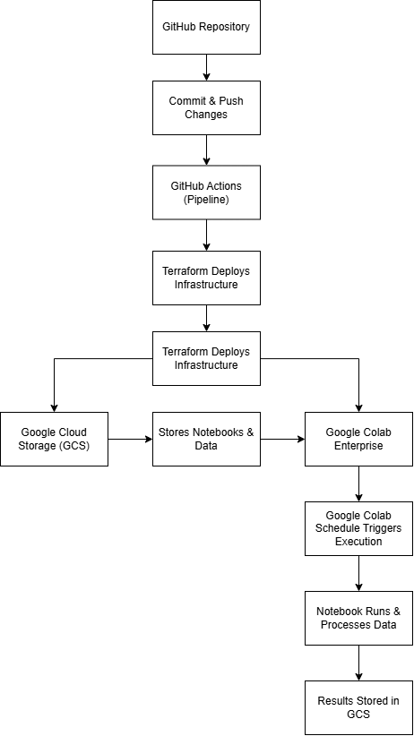

# 💻 Proyecto Google Meridian en GCP

## ✨ Descripción
Este proyecto implementa una arquitectura en **Google Cloud Platform (GCP)** para la ejecución programada de notebooks de **Google Meridian** mediante **Google Colab Enterprise**.

## 🛠️ Tecnologías Utilizadas
- **Terraform**: Para la gestión y despliegue de la infraestructura en GCP.
- **Google Cloud Storage (GCS)**: Para almacenamiento de notebooks y datos CSV.
- **Google Colab Enterprise**: 
  - ***Para la ejecución de notebooks en la nube.***
  - ***Para programar la ejecución automática del notebook***

---

## 🌐 Arquitectura del Proyecto

<p align="center">
  
</p>

### 💼 1. Cómputo
#### Google Colab Runtime Template
- **Tipo de máquina**: `e2-standard-4`
- **Acceso a internet**: Habilitado
- **Ubicación**: ` name_ubicación `
- **Función**: Proporciona el entorno de ejecución para el notebook de Meridian.

### 🏢 2. Almacenamiento
#### Google Cloud Storage (GCS)
- **Bucket**: `name-bucket`
- **Archivos almacenados**:
  - **Notebook**: `name_notebook.ipynb`
  - **Datos CSV**: `name_csv_datos.csv`
- **Función**: Permite almacenar y recuperar datos utilizados por el notebook.

### ⏰ 3. Programación y Ejecución
#### Google Colab Schedule
- **Frecuencia**: ` ` (Ejecución ** hora de Lima)
- **Duración**: del **00/00/0000 al 00/00/0000**
- **Tiempo máximo de ejecución**: `86400s` (24 horas)
- **Fuente del notebook**: `gs://name-bucket/name_notebook.ipynb`
- **Salida de ejecución**: `gs://name-bucket/`
- **Cuenta de servicio**: ` cuenta_de_servicio `

---

## 🛠️ Instalación y Configuración

### 🔨 Prerrequisitos
Antes de desplegar el proyecto, asegúrate de tener:
- **Terraform** instalado en tu máquina.
- **Acceso a GCP** con los permisos adecuados.
- **Cuenta de servicio** configurada con acceso a Colab Enterprise y GCS.

### ⚙️ Configuración de Variables de Entorno
Para ejecutar el proyecto, es necesario configurar las siguientes variables:

- **`SERVICE_ACCOUNT_EMAIL`**: Correo electrónico de la cuenta de servicio en GCP.
- **`PROJECT_ID`**: ID del proyecto en Google Cloud.
- **`BUCKET_NAME`**: Nombre del bucket en Google Cloud Storage donde se almacenarán los notebooks y datos.
- **`GCP_CREDENTIALS_JSON`**: Archivo JSON de la cuenta de servicio y configurar el proveedor de Google en Terraform.

#### Configuración local
Si estás ejecutando el proyecto localmente, define estas variables en el archivo `variables.tfvars`:

```hcl
service_account_email = "tu-cuenta-de-servicio@gcp.com"
project_id = "tu-proyecto-id"
bucket_name = "tu-bucket"
```

Además, deberás descargar el archivo JSON de la cuenta de servicio y configurar el proveedor de Google en Terraform. Guarda el archivo en tu equipo y agrega la siguiente configuración en el provider:

```hcl
provider "google" {
  credentials = file("./gcp-credentials.json")
  project     = var.project_id
  region      = "us-central1"
}
```

#### Configuración en GitHub Actions
Si ejecutas el despliegue a través de un pipeline en GitHub Actions, define las variables en la configuración del repositorio:

1. Ve a **Settings** → **Secrets and variables** → **Actions**.
2. Agrega las secret:
   - `GCP_CREDENTIALS_JSON`

2. Agrega las siguientes variables:
   - `SERVICE_ACCOUNT_EMAIL`
   - `PROJECT_ID`
   - `BUCKET_NAME`

### Configuración del notebook (meridian_lite_weekly.ipynb)
Antes de ejecutar el script, es necesario modificar el nombre del bucket en el código para que coincida con el nombre correcto en su entorno.

```python
BUCKET_NAME = "nombre-del-bucket-correcto"
```

Reemplazar `nombre-del-bucket-correcto` con el nombre real de su bucket en Google Cloud Storage.

---

### 🏗️ Despliegue

El despliegue de la infraestructura puede realizarse de dos formas: **localmente** o a través de **pipeline (GitHub Actions)**.

#### Localmente

```sh
# Clona este repositorio
git clone https://github.com/PerpetualTecnologies/meridian-gcp-infra.git
cd meridian-gcp-infra

# Para despliegue local:
terraform init
terraform plan -var-file="variables.tfvars"
terraform apply -auto-approve -var-file="variables.tfvars"
```

#### Pipeline

```sh
# Para despliegue vía pipeline (GitHub Actions):
git add .
git commit -m "Ajustes en la configuración de Terraform"
git pull
git push
```

📌 **Nota:** Al hacer `git push`, la pipeline se activará automáticamente en GitHub Actions y aplicará la configuración en GCP.